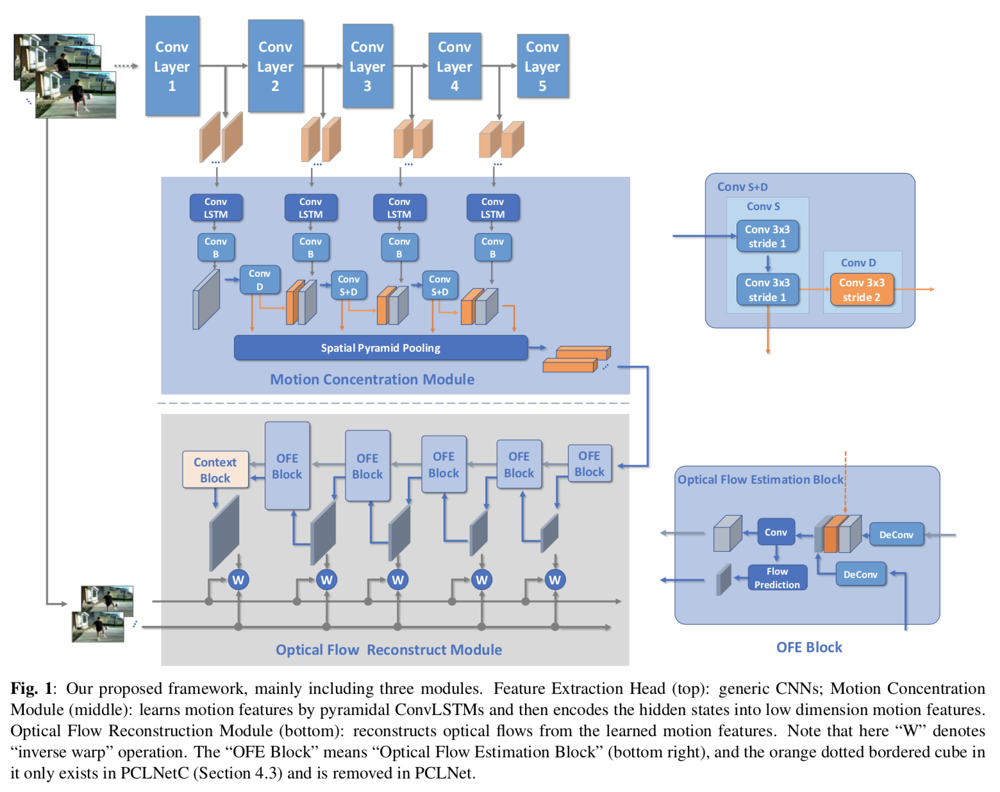

# PCLNet
 This repo contains source code for the paper:

> Unsupervised Learning for Optical Flow Estimation Using Pyramid Convolution LSTM. *In Proceedings of IEEE International Conference on Multimedia and Expo(ICME). 2019.*

## Framework




## Acknowledgement
The implementation for Mean Structural Similarity (MSSIM) metric [(models/ssim_module.py)](models/ssim_module.py) is derived from: [https://github.com/Po-Hsun-Su/pytorch-ssim.git](https://github.com/Po-Hsun-Su/pytorch-ssim.git)


## Citations
If you use PCLNet, please cite the following paper: 
```
@InProceedings{PCLNet-icme2019,
  author    = {Shuosen Guan, Haoxin Li, Wei-Shi Zheng},
  title     = {Unsupervised Learning for Optical Flow Estimation Using Pyramid Convolution LSTM},
  booktitle = {Proceedings of IEEE International Conference on Multimedia and Expo(ICME)},
  year      = {2019},
}
```
